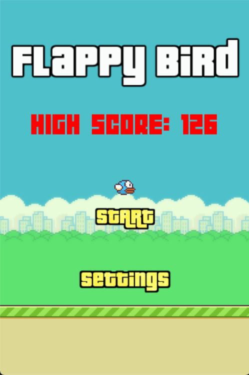
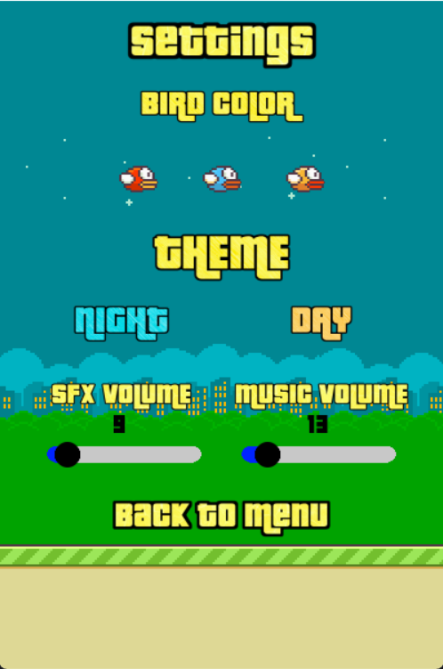
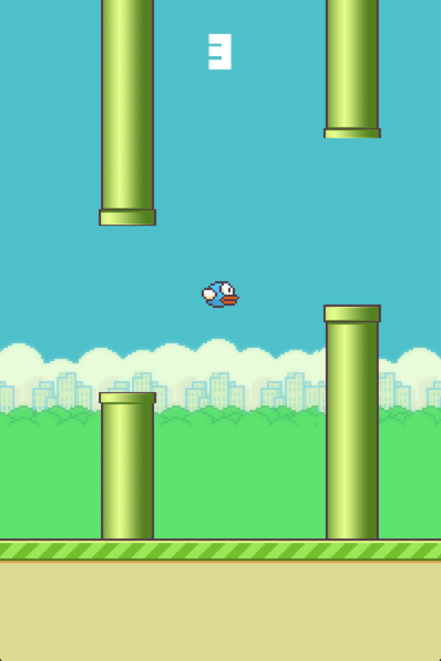
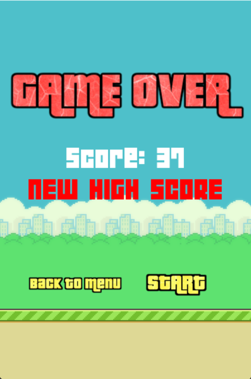

# Flappy Bird

**Flappy Bird** je 2D arkádová hra, v ktorej hráč ovláda malého vtáčika, ktorý prelieta pomedzi prekážky, aby sa vyhol otrasu mozgu.

## Pointa hry
- Hráč ovláda vtáčika.
- Hlavnou úlohou je **vyhýbať sa trubkám**, ktoré su z nejakého dôvodu rozmiestnené z hora aj z dola priamočiaro v meste.
- Získať čo najvyššie skóre.
- Hra končí stavom *Game Over*, keď dôjde ku kolízii.

## Ovládanie
#### kliknutí myšky na tlačidlo štart spustíme hru

| Klávesa | Akcia |
| :--- | :--- |
| **Medzerník (Space)** | Skok |
| **ESC** | Ukončenie celého programu |

## Vlastnosti hry

- **Zvuk:** Zvukové efekty pre lepší zážitok.
- **Počítanie skóre:** Sledovanie úspešnosti hráča.
- **OOP:** Použitie tried a objektov v kóde.
- **Game Over stav:** Jasné ukončenie hry pri neúspechu.
- **Grafika:** Použitie farieb, textu a pixel-art štýlu.

## Rozdelenie práce
**Tomáš Ivan** - engine, vzhľad
 
**Lukáš Červeňák** - menu, vzhľad

**Pavol Lompart** - zvuk, readme :)

## Credits

Projekt využíva hudbu a zvukové efekty z nasledujúcich stránok:

https://mixkit.co/free-sound-effects/
https://uppbeat.io/music/category/game